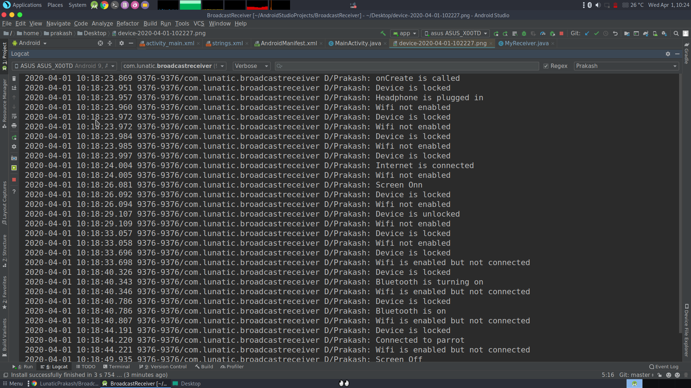

# Broadcast-Receiver
This repo contains implementation of various Broadcast Receiver(like Screen On/Off, Device lock/unlock, Headphone plugged in/out, Wifi enabled/disabled/connected/disconnected, Bluetooth enabled/disbaled/connected/disconnected and much more) in a very modular and simpler way.

## Purpose :- 

To understand the code of each Broadcast Receiver or just simply Ctrl+c and Ctrl+v to use it in your project.

## Broadcast Receiver available :-

1. Boot Completed
2. Screen Off
3. Screen On
4. Device Unlocked
5. Device locked
6. Power Source is connected(Charging)
7. Power Source is disconnected(Discharging)
8. Batter Low
9. Earphone plugged in/Out
10. Internet is connected
11. Bluetooth Turning On/Off
12. Bluetooth On/Off
13. Bluetooth Connected/Disconnected(Even shows the name of the device to which it is connected, or from disconnected)
14. GPS is On
15. GPS is off
16. Wifi Enabled/Disbaled
17. Wifi Connected/Disconnected
18. Wifi Enabled but not connected

### Dependencies :-
Neither any extra dependency nor any third party module is required.

## Description :-

All these above mentioned Broadcast Receivers gets triggered whenever those events happen, I have put Toast and Logcat messages when they get triggered but you can replace them with whatever you want to do, like changing wallpaper whenever your phone is charging, or like launching something when battery is low, or play some sound whenever bluetooth gets connected and much more. All these infinite possibilities are there, you can make whatever you want.

## Screenshots :-

## Bugs and Improvements :-
No bugs.
However, as multiple Toast messages will overlap each other so, you might not see toast messages in proper order. But as code is completely valid and sequential, so you will get correct result in logcat. And if you replace these Toasts and logcat messages with your own action you will not face any problem. It's just Toasts aren't reliable when used in bulk.

# Dev :- Prakash Gupta
